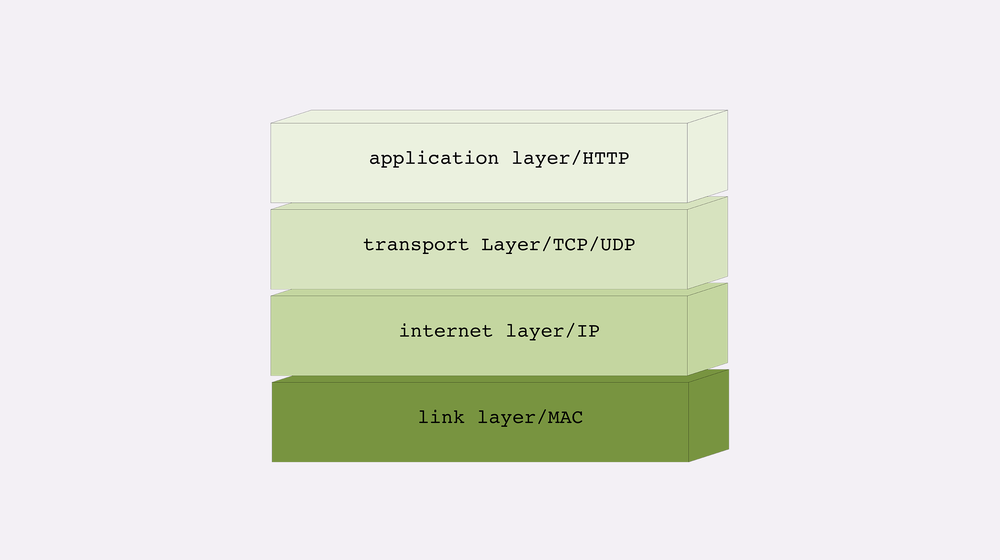
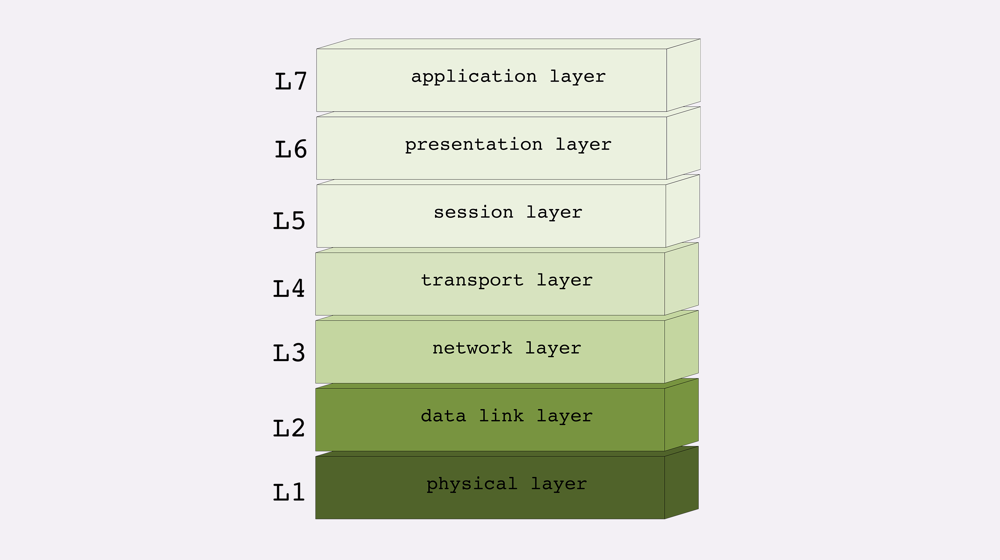

四层负载均衡
传输层：
七层负载均衡
二层转发
```text
1、二层是数据链路层、MAC层， 原理是基于原MAC、与目的MAC和MAC地址表进行业务转发。  交换机通过MAC 地址进行转发和广播。
2、工作在二层的设备（i.e交换机）只认识MAC地址，所以建立MAC地址和端口的映射关系，来决定往哪个端口转发。
3、设备工作在链路层，帧在经过交换机设备时，检查帧的头部信息，拿到目标mac地址，进行本地转发和广播
```
三层路由
```text

```

MAC传输单位是帧
IP层传输单位是包
TCP层传输单位是段
HTTP 的传输单位则是消息或报文



MAC:
